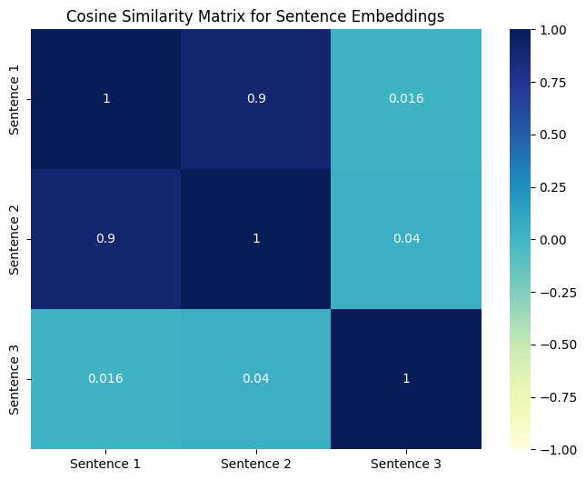

# Prepare the environment: 
Clone the repository and switch to the current branch, than:  
```bash
uv venv --python 3.13
uv pip install -e .
```
### Activate the environment:
Linux:  
```bash
source .venv/bin/activate
```  
Windows:  
```bash
.venv\Scripts\activate
```
# Generating of sentences embeddings  
To run a program with sample sentences and the current directory to save:
```bash
python GenAI-1-30.py
```

To run the program with castom parameters:
```bash
python GenAI-1-30.py -s <sentences-file-path> -o <output-dir>
```
# Example

1. Cosine similarity measures the angle between two vectors to determine their similarity.
2. The cosine similarity metric evaluates how close two vectors are by calculating the cosine of the angle between them.
3. Machine learning models require large datasets to achieve high accuracy.


