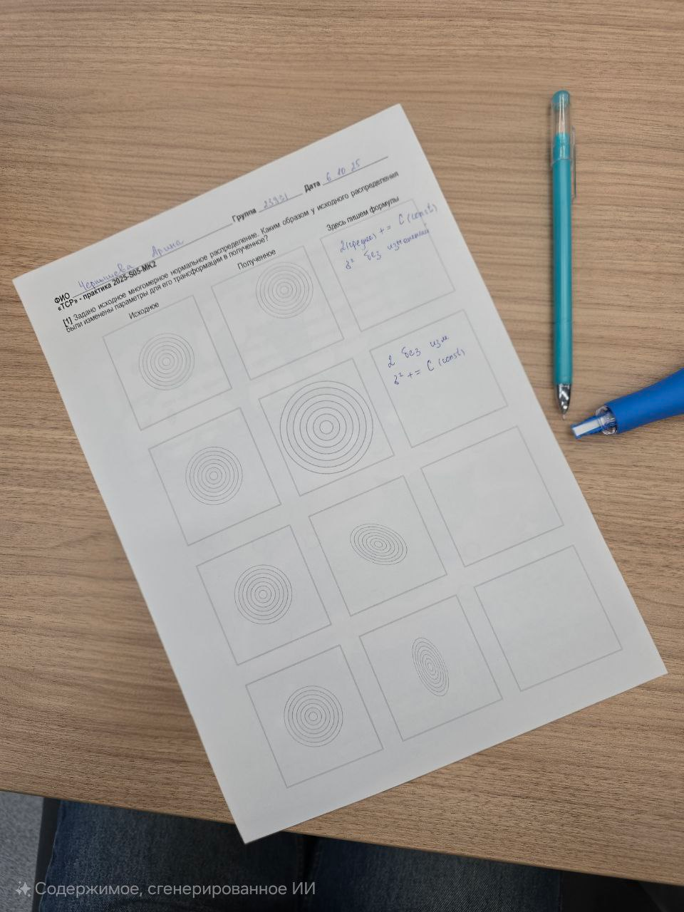
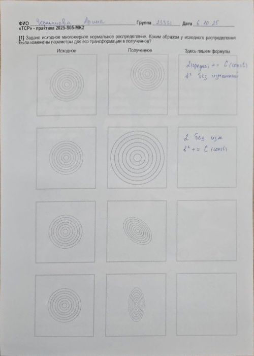

# Prepare the environment: 
Clone the repository and switch to the current branch.  
## Create the environment:
```bash
uv venv --python 3.13
uv pip install -r perspective_correction/requirements.txt
```
### Activate the environment:
Linux:  
```bash
source .venv/bin/activate
```  
Windows:  
```bash
.venv\Scripts\activate
```
# Perspective straightening and cropping  
Firstly, go to the *./perspective_correction* directory  
To run a program with sample image and the *'./sources'* directory to save:
```bash
# 1) A basic example with a fixed size of 500x700 (default)
python documen_perspective_correction.py -i ../sources/wrong_perspective.png -o ../sources/correct_perspective.jpg

# 2) Automatically output the target size from the document geometry (width/height = 0)
python documen_perspective_correction.py -i ../sources/wrong_perspective.png -o ../sources/correct_perspective.jpg --width 0 --height 0

# 3) Custom size (for example, 600x900)
python documen_perspective_correction.py -i ../sources/wrong_perspective.png -o ../sources/correct_perspective.jpg --width 600 --height 900
```

# Example
 
