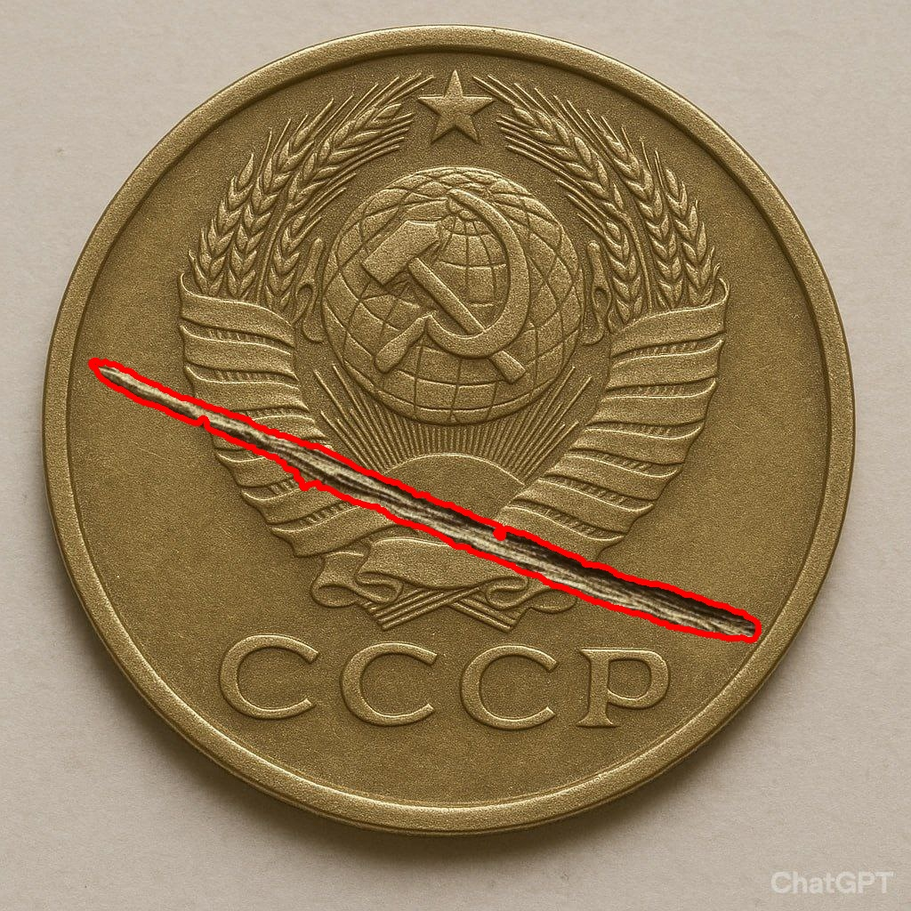

# Prepare the environment: 
Clone the repository and switch to the current branch.  
## Create the environment:
```bash
uv venv --python 3.13
uv pip install -e .
```
### Activate the environment:
Linux:  
```bash
source .venv/bin/activate
```  
Windows:  
```bash
.venv\Scripts\activate
```
##  Or install the requirements in your global env:
```bash
pip install -r requirements.txt
```  
# Detecting defects on coins  
To run a program with sample images and the *'./result'* directory to save:
```bash
python find_defects.py
```

To run the program with castom parameters:  
```bash
python find_defects.py --dir <images-dir> --standart <standart-coin-filename> --out <output-dir>
```
*Standart coin image should be in the \<images-dir\>!*
# Example
 
